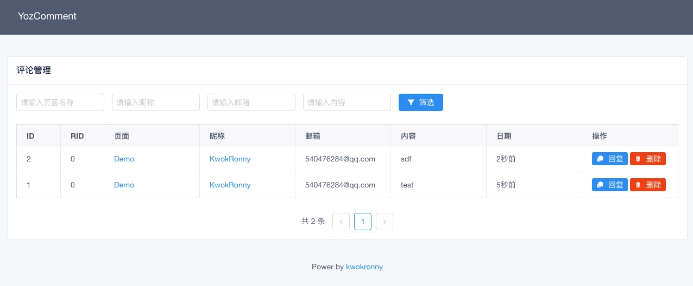

<center>

<p style="font-size:24px;font-weight:bold;">YozComment</p>
<p>作者：<a href="https://kwokronny.top">KwokRonny</a></p>
</center>

## 介绍
开源的 golang 评论系统。因自己博客与他人共用服务器，暂时知名的几个系统都是需要在服务器安装一定的依赖或环境，不想增加服务器负担，顺带学习 golang 的态度，便自己造了这个轮子。


- ### 优势
	* 支持MySQL、SQLite、PostgreSQL
	* 多级评论
	* 部署简单，可视化配置
	* 支持 明/暗 主题
	* 支持响应式
	* 接入Gravatar头像显示
	* 支持敏感词识别
	* 支持邮件通知
	

## 安装

- ### 部署至服务器
	```bash
	nohup ./YozComment > /dev/null 2>&1 &
	```

- ### 配置安装

	运行后会检测到应用目录下 `./config.yaml` 是否存在，判断是否运行配置过程。

	访问 http://localhost:9975 会进入安装配置页面
	
	

	根据配置页面操作完成后会在相应位置生成 `config.yaml` 配置文件后，手动重新启动应用

- ### 在页面中引用代码
	
	在展示评论组件的位置添加以下代码

	```html
	<script 
		id="YozComment" 
		src="http://{部署地址}/client.js" 
		token="页面唯一TOKEN" 
		theme="{light|dark}" 
		crossorigin="anonymous" 
		async></script>
	```

- ### 管理后台

	可以通过自定义 扰乱字符 为后台管理入口

	如设置路由为 `gkqoSDBxv43fgL9CP3pV9u`

	则后台管理路由为 https://{部署址址}/gkqoSDBxv43fgL9CP3pV9u/

	

## 开发

- ### 前端

	- 评论组件部分

		应用 Typescript 开发，开发架构及思路部分主要借鉴 [utterance](https://github.com/utterance/utterances) 。通过在网站内嵌 iframe 减少对代码间的冲突与安全问题。
		
		运行以下命令会将相关静态文件编译至 templates/web 文件夹下，并热更新应用

		```bash
		npm start 
		```
	
	- 后台管理

		采用纯前端方式通过  CDN 引用 iviewui+axios完成配置页面，管理页面及登陆界面

- ### 后端

	后端运用 gin+gorm 开发，开发架构主要是MVC架构，并将所有静态资源 通过 gin-bindata 打包进应用，方便部署。

	安装 fresh 开启热更新

	应用 go generate 

	```bash 
	npm run bindata
	# 在开发中，方便调试，通过 gin-bindata 提供的方法 对静态资源通过暂时链接的方法调用
	fresh # 热更新启动
	```

- ### 构建 

	```bash
	npm run build
	go generate
	go build main.go
	```